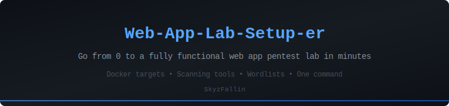

<p align="center">
  
</p>

<p align="center">
  
  
  
  
  
  
</p>

# Web-App-Lab-Setup-er

One-command setup for a complete web application penetration testing lab — deploys vulnerable Docker targets, installs scanning tools, and drops wordlists. Ready to hack in minutes.

**Author:** [SkyzFallin](https://github.com/SkyzFallin)

## What It Does

* Installs Docker and deploys **DVWA** and **OWASP Juice Shop** as vulnerable targets
* Installs pentest tools: **sqlmap**, **ffuf**, **gobuster**, **nikto**, **nuclei**
* Pulls **SecLists** and **dirb** wordlists
* Generates a `docker-compose.yml` and a `lab.sh` management script at `/opt/webapp-pentest-lab/`
* Supports `--tools-only`, `--targets-only`, and `--uninstall` flags
* Detects OS, architecture, disk space, RAM, and internet connectivity before running
* Works on Ubuntu 22.04+, Debian 12+, and Kali Linux 2024+

## Quick Start

```bash
git clone https://github.com/SkyzFallin/Web-App-Lab-Setup-er.git
cd Web-App-Lab-Setup-er
chmod +x setup.sh
sudo ./setup.sh
```

Once complete, open your browser:

* **DVWA**: http://localhost:8080 — login with `admin` / `password`
* **Juice Shop**: http://localhost:3000 — register a new account

## Vulnerable Targets

| Target | Port | Description |
|--------|------|-------------|
| **DVWA** | 8080 | Classic PHP/MySQL vulnerable app — SQLi, XSS, CSRF, file upload, command injection |
| **OWASP Juice Shop** | 3000 | Modern Angular/Node.js app — 100+ challenges covering OWASP Top 10 |

## Tools Installed

| Tool | Purpose |
|------|---------|
| **sqlmap** | Automated SQL injection |
| **ffuf** | Directory/parameter fuzzing |
| **gobuster** | Directory brute-forcing |
| **nikto** | Web server scanning |
| **nuclei** | Template-based vulnerability scanning |

## Wordlists

* **SecLists** — the industry standard collection
* **dirb** — classic directory wordlists

## Usage Options

```bash
# Full install (tools + targets + wordlists)
sudo ./setup.sh

# Tools only (no Docker targets)
sudo ./setup.sh --tools-only

# Targets only (skip tool installation)
sudo ./setup.sh --targets-only

# Uninstall (remove containers and config)
sudo ./setup.sh --uninstall

# Help
./setup.sh --help
```

## Lab Management

After install, use the lab manager at `/opt/webapp-pentest-lab/lab.sh`:

```bash
lab.sh status    # Check what's running + tool inventory
lab.sh start     # Start lab containers
lab.sh stop      # Stop lab containers
lab.sh reset     # Destroy and re-deploy fresh containers
lab.sh destroy   # Remove everything (containers + images)
```

## Remote Access

If the lab is on a remote server, tunnel the ports over SSH:

```bash
ssh -L 8080:localhost:8080 -L 3000:localhost:3000 user@your-server-ip
```

Then access targets at `localhost:8080` and `localhost:3000` from your local browser through Burp Suite.

## Customization

Edit the configuration block at the top of `setup.sh`:

```bash
DVWA_PORT=8080           # Change DVWA port
JUICESHOP_PORT=3000      # Change Juice Shop port
FFUF_VERSION="2.1.0"     # Pin ffuf version
NUCLEI_VERSION="3.3.7"   # Pin nuclei version
```

Or override at runtime:

```bash
DVWA_PORT=9090 JUICESHOP_PORT=4000 sudo ./setup.sh
```

## Requirements

* **OS**: Ubuntu 22.04+, Debian 12+, or Kali Linux 2024+
* **RAM**: 4GB+ recommended (2GB minimum)
* **Disk**: 5GB+ free space
* **Access**: sudo / root privileges
* **Network**: Internet connection (for Docker pulls and tool downloads)

## Suggested Workflow

1. **Proxy setup** — Point your browser through Burp Suite (`127.0.0.1:8080`)
2. **Start with DVWA** — Set security to "Low", work through each vulnerability
3. **Progress through levels** — Move to Medium, then High as you get comfortable
4. **Graduate to Juice Shop** — Open `/score-board` and work through challenges by difficulty
5. **Automate** — Practice running nikto, nuclei, and sqlmap against the targets
6. **Report** — Write up findings as if it were a real engagement

## Adding More Targets

The `docker-compose.yml` at `/opt/webapp-pentest-lab/` can be extended:

```yaml
services:
  # ... existing targets ...

  webgoat:
    image: webgoat/webgoat:latest
    container_name: webgoat
    ports:
      - "8888:8080"
      - "9090:9090"
    restart: unless-stopped

  bwapp:
    image: raesene/bwapp:latest
    container_name: bwapp
    ports:
      - "8081:80"
    restart: unless-stopped
```

Then: `cd /opt/webapp-pentest-lab && docker compose up -d`

## Troubleshooting

| Issue | Fix |
|-------|-----|
| Docker permission denied | Log out and back in after install (group membership) or use `sudo` |
| Port already in use | Change `DVWA_PORT` or `JUICESHOP_PORT` in setup.sh |
| Juice Shop slow to start | Normal on first boot — give it 30-60 seconds |
| DVWA database not initialized | Click "Create / Reset Database" on the DVWA setup page |
| ffuf/nuclei download fails | Check internet connectivity; try manual install from GitHub releases |

## Notes

* The setup script uses `set -euo pipefail` for strict error handling
* All output is logged to `/tmp/webapp-pentest-lab-install.log`
* Docker containers are set to `restart: unless-stopped`
* Pre-flight checks validate OS, architecture, disk, RAM, and connectivity before any changes

## Changelog

* **v1.0** — Initial release. Full lab setup with DVWA, Juice Shop, pentest tools, wordlists, lab manager, and docker-compose generation.

## Credits

* **[DVWA](https://github.com/digininja/DVWA)** by digininja
* **[OWASP Juice Shop](https://github.com/juice-shop/juice-shop)** by Björn Kimminich
* **[SecLists](https://github.com/danielmiessler/SecLists)** by Daniel Miessler
* **[ffuf](https://github.com/ffuf/ffuf)** by joohoi
* **[nuclei](https://github.com/projectdiscovery/nuclei)** by ProjectDiscovery

## Project Hygiene

* See `AUDIT.md` for a practical GitHub security/coding improvement checklist.

## License

MIT — use it, share it, hack with it.
